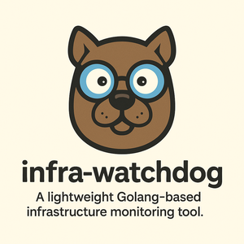

# infra-watchdog

A lightweight infrastructure watchdog written in Go.

## Features
- Monitor HTTP endpoints
- Log uptime status to a file
- Expose REST API for status and logs

## Usage
```bash
go run main.go
```

Visit:
- `http://localhost:8081/status` — Get current target status
- `http://localhost:8081/logs` — View latest logs

## Configuration
Edit `config/targets.json` to add your own URLs.

## Example Output
```json
{"timestamp":"2025-06-28T10:00:00Z","name":"Google","status":"UP"}
```

## Author
Bikram — Passionate about systems, monitoring, and Go.

---

Built with ❤️ in Golang.
